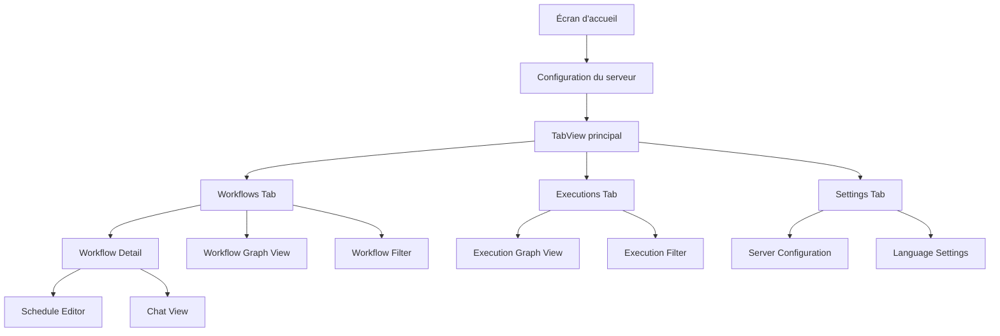

# N8Ninja App Screen Flow

Ce document présente l'enchaînement des écrans de l'application N8Ninja et les interactions entre eux.

## Flux de navigation principal

## Détail des écrans

### Écran d'accueil et configuration
- **Écran d'accueil**: Affiche le logo N8Ninja pendant le chargement
- **Configuration du serveur**: Permet d'ajouter un nouveau serveur ou de sélectionner un serveur existant

### TabView principal
Contient trois onglets principaux:
- **Workflows**: Liste des workflows du serveur
- **Executions**: Liste des exécutions récentes
- **Settings**: Paramètres de l'application

### Workflows
- **Liste des workflows**: Affiche tous les workflows avec leur statut (actif/inactif/manuel)
- **Workflow Detail**: Détails d'un workflow spécifique, permet d'activer/désactiver le workflow
- **Workflow Graph View**: Statistiques et graphiques sur les workflows
- **Workflow Filter**: Filtrage par statut et tags

### Executions
- **Liste des exécutions**: Affiche les exécutions récentes avec leur statut
- **Execution Graph View**: Graphiques des exécutions par période (24h, 7j, 30j)
- **Execution Filter**: Filtrage par statut et mode

### Détail du workflow
- **Informations générales**: Nom, ID, dates de création/modification
- **Triggers**: Liste des déclencheurs du workflow
- **Schedule Editor**: Modification des paramètres de planification
- **Chat View**: Interface de chat pour les triggers de type chat

### Paramètres
- **Server Configuration**: Gestion des connexions aux serveurs
- **Language Settings**: Choix de la langue de l'application

## Interactions et modales

### Modales
- **Filter Sheets**: Apparaissent depuis les vues principales pour filtrer les données
- **Schedule Editor**: Apparaît depuis la vue détaillée d'un workflow pour modifier la planification
- **Chat View**: Apparaît pour interagir avec un trigger de chat

### Actions
- **Pull to refresh**: Disponible sur les listes principales
- **Load more**: Chargement paginé des données
- **Toggle workflow active**: Activation/désactivation d'un workflow
- **Trigger webhook**: Déclenchement manuel d'un webhook
- **Share webhook URL**: Partage d'URL de webhook

## États d'exécution
Les exécutions peuvent avoir différents états, représentés par des icônes distinctes:
- **Success**: Exécution réussie (vert)
- **Error**: Erreur d'exécution (rouge)
- **Running**: En cours d'exécution (bleu)
- **Waiting**: En attente (orange)
- **Other**: Autres états (violet)

## États des workflows
Les workflows peuvent avoir différents états:
- **Active**: Workflow actif (vert)
- **Inactive**: Workflow inactif (gris)
- **Manual only**: Workflow déclenchable uniquement manuellement (rouge)
